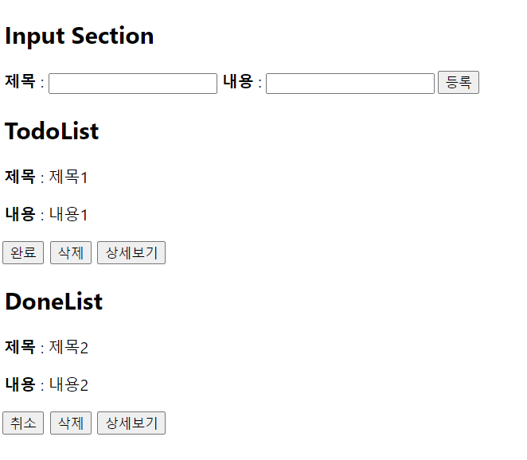
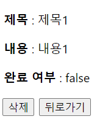

## TimeAttack - Q2

> Redux를 활용한 To-Do List 만들기

|               메인 페이지               |                세부 페이지                |
| :-------------------------------------: | :---------------------------------------: |
|  |  |

**컴포넌트 구조**

| 메인 페이지 | 세부 페이지 |
| :---------: | :---------: |
|  Home.jsx   | Detail.jsx  |

### Home.jsx

1. 컴포넌트 구조

- Header
- Main
  - InputSection
    - input (제목)
    - input (내용)
    - button (등록)
  - TodoListSection
    - TodoList
      - `isDone: false` 인 list
      - 표시 항목 : 제목, 내용, [완료] 버튼, [삭제] 버튼, [상세보기] 버튼
    - DoneList
      - `isDone: true` 인 list
      - 표시 항목 : 제목, 내용, [취소] 버튼, [삭제] 버튼, [상세보기] 버튼
- Footer

2. 추가사항

- TodoList와 DoneList는 하나의 컴포넌트를 사용해야 하며, `isActive` Props를 활용할 것
- [완료] 버튼 : TodoList -> DoneList / [취소] 버튼 : DoneList -> TodoList
- [상세보기] 버튼 : 해당 item의 상세정보가 출력되는 Detail.jsx로 이동

### Detail.jsx

1. 표시 항목 : 제목, 내용, 완료여부, [삭제] 버튼, [뒤로가기] 버튼
2. [뒤로가기] 버튼 클릭 시, 메인 페이지로 이동
3. [삭제] 버튼 클릭 시, 해당 todo item 삭제 후 메인 페이지로 이동
